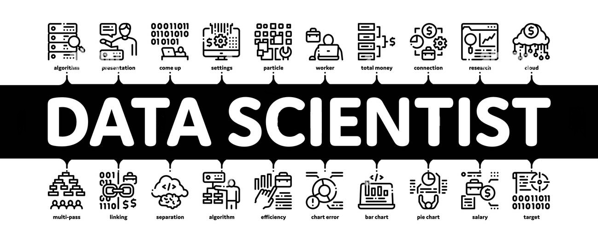
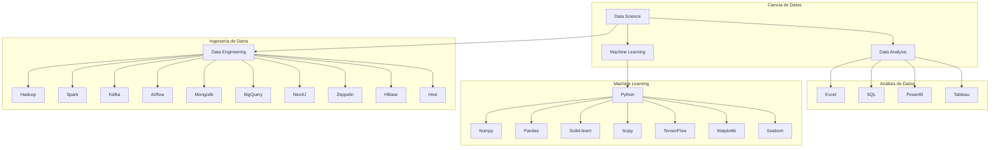

<h1 align="center">
    
</h1>
<h1 align="center">
    
</h1>

## <picture></picture> Hola a todos! 👋 Soy Michael 👩‍💻  

📊 Un apasionado de la ciencia de datos. Mi formación incluye estudios en Henry, donde adquirí sólidos conocimientos en SQL, Python y diversas herramientas de big data como MongoDB, Spark y Kafka, así como en visualización de datos con Tableau y Power BI. Actualmente estudio Ingeniería en Sistemas en la Universidad Tecnológica Nacional y completé el bootcamp de Henry en Data Science.

Mi pasión por el aprendizaje me motiva a explorar nuevas tecnologías y herramientas para resolver problemas de manera creativa y generar valor. Soy curioso, orientado a resultados y disfruto trabajando en equipo para superar desafíos.

  
<h2> &nbsp;Habilidades técnicas </h2>

- 💻 &nbsp;
  
  
  
- 📚 &nbsp;
  
  
  
  
  
  
- 🛢 &nbsp;
  
  
  
  
- 🔧 &nbsp;
  
  
  
  
- 📊 &nbsp;
  
  
- ⚙️ &nbsp;
  
  
  
  
  

<!--
**bkmay1417/bkmay1417** is a ✨ _special_ ✨ repository because its `README.md` (this file) appears on your GitHub profile.

Here are some ideas to get you started:

- 🔭 I’m currently working on ...
- 🌱 I’m currently learning ...
- 👯 I’m looking to collaborate on ...
- 🤔 I’m looking for help with ...
- 💬 Ask me about ...
- 📫 How to reach me: ...
- 😄 Pronouns: ...
- ⚡ Fun fact: ...
-->

 
<h2 align="center">  Stats </h2>
 

  
     
     
  
   
     
  
     
     
    

<strong style="font-size: 1.2em;"></img> &nbsp;Proyectos destacados </img><strong>
<h2></h2>

<table>
<tr>
  <td width="50%">
    <h3 align="center">Machine Learning Operations MLOps</h3>
    
                                       
        
         
        

        
El objetivo es crear un Producto Mínimo Viable (MVP) que incluye la implementación de una API para obtener información sobre desarrolladores, usuarios, géneros.

        
Data Science/Data Engineer

    
   
</td>
<td width="50%">
    <h3 align="center">Siniestros viales</h3>
    

        
        

        
Este proyecto se realizó simulando ser un Data Analist de una consultora; y tiene como finalidad la elaboración de un análisis de datos solicitado por el Observatorio de Movilidad y Seguridad Vial (OMSV), bajo la órbita de la Secretaría de Transporte del Gobierno de la Ciudad Autónoma de Buenos Aires (CABA).

        
Data Analytics

    

</table>
 
<table>
<tr>  
  <td width="50%">
    <h3 align="center">Taxis en NYC</h3>
    

        
        

        
La movilidad en New York ha aumentado la demanda de taxis, impactando varias dimensiones, siendo el transporte el mayor productor de CO2 en EE.UU. Para mitigar su impacto ambiental y satisfacer las necesidades de transporte, este proyecto evaluará la incorporación de una flota de taxis eléctricos en la ciudad.

        
Proyecto colaborativo

    
                                                                          
</td> 
</table>                                                                                 

  

 

##   Links  

     

